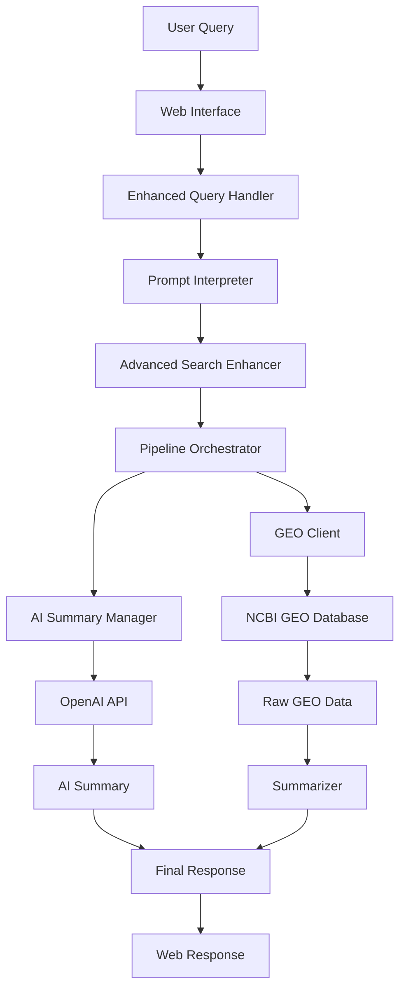

# 🏗️ OmicsOracle Architecture Overview

## 🎯 System Purpose
OmicsOracle is a genomics data analysis platform that processes natural language queries to retrieve and summarize relevant research data from NCBI GEO (Gene Expression Omnibus).

---

## 🔄 Core Query Processing Flow



---

## 📁 Core Architecture Components

### **🌐 Presentation Layer**
```
src/omics_oracle/presentation/web/
├── main.py              # FastAPI application entry point
├── dependencies.py      # Dependency injection setup
├── routes/
│   ├── query.py        # Main query endpoint (/query)
│   ├── health.py       # Health check endpoints
│   └── summary.py      # Summary endpoints
├── middleware/
│   ├── cors.py         # CORS configuration
│   ├── logging.py      # Request/response logging
│   └── error_handler.py # Global error handling
└── websockets.py       # Real-time communication
```

### **🔍 Search & Query Processing**
```
src/omics_oracle/search/
├── enhanced_query_handler.py    # Main query coordinator
└── advanced_search_enhancer.py  # Query optimization & enhancement
```

### **🧠 Natural Language Processing**
```
src/omics_oracle/nlp/
├── prompt_interpreter.py       # Query intent understanding
└── biomedical_ner.py          # Biomedical entity recognition
```

### **⚙️ Processing Pipeline**
```
src/omics_oracle/pipeline/
└── pipeline.py                 # Main orchestration pipeline
```

### **🔗 External Data Integration**
```
src/omics_oracle/geo_tools/
└── geo_client.py               # NCBI GEO API client
```

### **🤖 AI Services**
```
src/omics_oracle/services/
├── ai_summary_manager.py       # OpenAI integration
├── summarizer.py              # Data summarization
├── cost_manager.py            # API cost tracking
└── cache.py                   # System-level caching (non-user-facing)
```

### **🛠️ Core Infrastructure**
```
src/omics_oracle/core/
├── config.py                  # Configuration management
├── models.py                  # Data models & schemas
├── logging.py                 # Logging configuration
└── exceptions.py              # Custom exceptions
```

---

## 🔄 Detailed Query Processing Flow

### **1. Query Reception** 📨
- **Entry Point**: `POST /query` endpoint in `routes/query.py`
- **Input**: Natural language query from user
- **Output**: Query object with metadata

### **2. Query Enhancement** 🚀
- **Component**: `enhanced_query_handler.py`
- **Process**:
  - Validates and preprocesses query
  - Coordinates with other components
  - Manages query lifecycle
- **Output**: Enhanced query object

### **3. Intent Understanding** 🧠
- **Component**: `prompt_interpreter.py`
- **Process**:
  - Analyzes query intent and context
  - Extracts biomedical entities
  - Determines search strategy
- **Output**: Structured query parameters

### **4. Search Optimization** 🔍
- **Component**: `advanced_search_enhancer.py`
- **Process**:
  - Refines search terms
  - Applies domain-specific knowledge
  - Optimizes for GEO database structure
- **Output**: Optimized search parameters

### **5. Pipeline Orchestration** ⚙️
- **Component**: `pipeline.py`
- **Process**:
  - Coordinates data retrieval and processing
  - Manages parallel operations
  - Handles error recovery
- **Output**: Orchestrated data flow

### **6. Data Retrieval** 📊
- **Component**: `geo_client.py`
- **Process**:
  - Connects to NCBI GEO API
  - Retrieves relevant datasets
  - Handles API rate limiting
- **Output**: Raw GEO dataset information

### **7. AI Summarization** 🤖
- **Components**: `ai_summary_manager.py` + `summarizer.py`
- **Process**:
  - Sends data to OpenAI API
  - Generates human-readable summaries
  - Manages API costs and usage
- **Output**: Structured summaries

### **8. Response Assembly** 📋
- **Component**: Query handler coordination
- **Process**:
  - Combines data and summaries
  - Formats for web response
  - Adds metadata and timing
- **Output**: Final JSON response

---

## 🔧 Key Design Principles

### **1. Direct Data Flow** 🎯
- No user-facing caching - all results are fresh from source
- Linear processing pipeline for predictability
- Clear separation of concerns

### **2. Fail-Safe Architecture** 🛡️
- Graceful degradation when external APIs fail
- Comprehensive error handling and logging
- Timeout protection for all external calls

### **3. Scalable Design** 📈
- Stateless components for horizontal scaling
- Async/await patterns for concurrent processing
- Configurable rate limiting and resource management

### **4. Maintainable Code** 🧹
- Single responsibility principle
- Clear dependency injection
- Comprehensive logging and monitoring

---

## 🌍 External Dependencies

### **Required Services**
- **NCBI GEO API**: Primary data source for genomics datasets
- **OpenAI API**: AI-powered summarization and analysis
- **FastAPI**: Web framework for REST API

### **Configuration**
- Environment-based configuration (dev/test/prod)
- API keys managed via environment variables
- Docker support for containerized deployment

---

## 🚀 Getting Started

### **Quick Start**
```bash
# Install dependencies
pip install -r requirements.txt

# Set environment variables
cp .env.example .env
# Edit .env with your API keys

# Start the application
./start.sh
```

### **Development**
```bash
# Start with development features
./start.sh --dev

# Backend only
./start.sh --backend-only

# Run tests
pytest tests/
```

---

## 📊 Performance Characteristics

- **Query Response Time**: ~2-10 seconds (depending on data complexity)
- **Concurrent Users**: Scales with container resources
- **API Rate Limits**: Managed automatically with backoff strategies
- **Memory Usage**: ~100-500MB per instance
- **Storage**: Minimal (no persistent user data caching)

---

**🔍 For detailed implementation information, see the source code in `src/omics_oracle/`**
