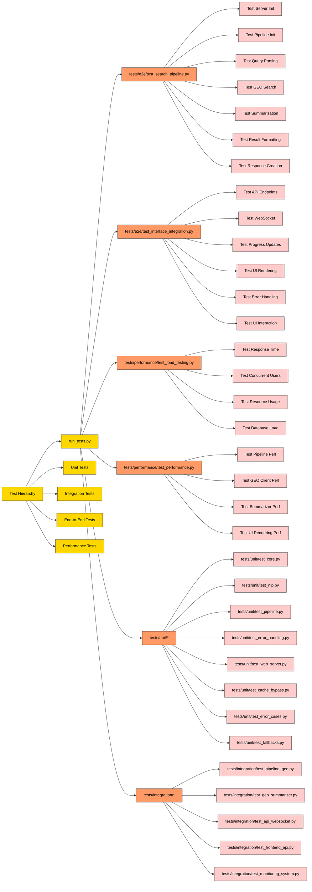

# OmicsOracle Event Flow and Validation Chart

This document provides a visual representation of the OmicsOracle system's event flow and the corresponding test/validation files.

## Event Flow Diagram

```mermaid
graph TD
    %% Define styles
    classDef keyEvent fill:#4682B4,color:white,stroke:#333,stroke-width:1px;
    classDef normalEvent fill:#ADD8E6,color:black,stroke:#333,stroke-width:1px;
    classDef testFile fill:#FFFFE0,color:black,stroke:#333,stroke-width:1px,stroke-dasharray: 5 5;
    classDef monitorFile fill:#90EE90,color:black,stroke:#333,stroke-width:1px,stroke-dasharray: 5 5;
    
    %% Server Initialization
    subgraph "1. Server Initialization"
        A1[Server Startup] --> A1a[Logging Setup]
        A1a --> A1b[Path Setup]
        A1b --> A1c[Environment Variables]
        A1c --> A1d[Entrez Email Patch]
        A1d --> A2[Config Loading]
        A2 --> A3[NCBI Email Config]
        A3 --> A3a[Bio.Entrez Setup]
        A3a --> A4[Pipeline Initialization]
        A4 --> A5[Component Initialization]
        A5 --> A5a[GEO Client Init]
        A5 --> A5b[NLP Interpreter Init]
        A5 --> A5c[BiomedicalNER Init]
        A5 --> A5d[Synonym Mapper Init]
        A5 --> A5e[Summarizer Init]
        A5 --> A5f[Search Service Init]
        A5a --> A5g[Cache Disabling]
        A5e --> A5g
        A5g --> A5h[Progress Callback Setup]
        A5h --> A6[API Routes Setup]
        A6 --> A6a[Static Files Setup]
        A6a --> A6b[CORS Setup]
        A6b --> A6c[WebSocket Manager Setup]
    end
    
    %% Search Process
    subgraph "2. Search Process"
        B1[Search Request] --> B1a[Request Validation]
        B1a --> B1b[Pipeline Availability Check]
        B1b --> B1c[WebSocket Notification]
        B1c --> B2[Query Processing]
        B2 --> B2a[Entity Extraction]
        B2a --> B2b[Query Expansion]
        B2b --> B2c[Intent Detection]
        B2c --> B3[GEO Database Search]
        B3 --> B3a[NCBI Connection]
        B3a --> B3b[ESearch Request]
        B3b --> B3c[ESummary Request]
        B3c --> B4[Result Processing]
        B4 --> B4a[Metadata Extraction]
        B4a --> B4b[Result Filtering]
        B4b --> B5[AI Summarization]
        B5 --> B5a[OpenAI API Request]
        B5a --> B5b[Summary Generation]
        B5b --> B6[Result Formatting]
        B6 --> B6a[Result Sorting]
        B6a --> B6b[Response Preparation]
        B6b --> B6c[Quality Check]
        B6c --> B6d[Response Creation]
    end
    
    %% Frontend Rendering
    subgraph "3. Frontend Rendering"
        C1[WebSocket Connection] --> C1a[WebSocket Connection Acceptance]
        C1a --> C1b[WebSocket Message Handler]
        C1b --> C2[Progress Updates]
        C2 --> C2a[Progress Event Parsing]
        C2a --> C2b[Progress Bar Update]
        C2b --> C2c[Live Monitor Update]
        C2c --> C3[Results Preparation]
        B6d --> C3
        C3 --> C3a[Results JSON Parsing]
        C3a --> C3b[Search History Update]
        C3b --> C3c[Results Rendering]
        C3c --> C3d[Dataset Card Creation]
        C3d --> C3e[GEO Summary Display]
        C3e --> C3f[AI Summary Display]
        C3f --> C4[Error Handling]
        C4 --> C4a[API Error Processing]
        C4a --> C4b[WebSocket Error Processing]
        C4b --> C4c[UI Error Display]
    end
    
    %% Connections between sections
    A6b --> B1
    A6b --> C1
    
    %% Test and Validation Files - Server Initialization
    TA1[tests/interface/test_server.py] -.-> A1
    TA1a[tests/utils/test_logging.py] -.-> A1a
    TA1b[tests/unit/test_path_setup.py] -.-> A1b
    TA1c[test_environment_variables.py] -.-> A1c
    TA1d[test_entrez_patch.py] -.-> A1d
    TA2[tests/unit/test_core.py] -.-> A2
    TA3[test_ncbi_config.py] -.-> A3
    TA3a[test_bio_entrez_setup.py] -.-> A3a
    TA4[tests/pipeline/test_initialization.py] -.-> A4
    TA5[debug_pipeline.py] -.-> A4
    TA5a[tests/geo_tools/test_geo_client_init.py] -.-> A5a
    TA5b[tests/nlp/test_interpreter_init.py] -.-> A5b
    TA5c[tests/nlp/test_biomedical_ner_init.py] -.-> A5c
    TA5d[tests/nlp/test_synonym_mapper_init.py] -.-> A5d
    TA5e[tests/services/test_summarizer_init.py] -.-> A5e
    TA5f[tests/services/test_search_service_init.py] -.-> A5f
    TA5g[tests/unit/test_cache_disabling.py] -.-> A5g
    TA5h[test_progress_callback_setup.py] -.-> A5h
    TA6[tests/interface/test_api_routes.py] -.-> A6
    TA6a[tests/interface/test_static_files.py] -.-> A6a
    TA6b[tests/interface/test_cors.py] -.-> A6b
    TA6c[tests/interface/test_websocket_setup.py] -.-> A6c
    
    %% Test and Validation Files - Search Process
    TB1[tests/interface/test_api_endpoints.py] -.-> B1
    TB1a[tests/unit/test_request_validation.py] -.-> B1a
    TB1b[tests/unit/test_pipeline_check.py] -.-> B1b
    TB1c[tests/interface/test_websocket_notification.py] -.-> B1c
    TB2[tests/unit/test_query_processing.py] -.-> B2
    TB2a[tests/nlp/test_entity_extraction.py] -.-> B2a
    TB2b[tests/nlp/test_query_expansion.py] -.-> B2b
    TB2c[tests/nlp/test_intent_detection.py] -.-> B2c
    TB3[tests/geo_tools/test_geo_client.py] -.-> B3
    TB3a[test_ncbi_connection.py] -.-> B3a
    TB3b[tests/geo_tools/test_esearch.py] -.-> B3b
    TB3c[tests/geo_tools/test_esummary.py] -.-> B3c
    TB4[tests/unit/test_pipeline.py] -.-> B4
    TB4a[tests/geo_tools/test_metadata_extraction.py] -.-> B4a
    TB4b[tests/unit/test_result_filtering.py] -.-> B4b
    TB5[tests/services/test_summarizer.py] -.-> B5
    TB5a[tests/services/test_openai_api.py] -.-> B5a
    TB5b[tests/services/test_summary_generation.py] -.-> B5b
    TB6[tests/unit/test_result_formatter.py] -.-> B6
    TB6a[tests/unit/test_result_sorting.py] -.-> B6a
    TB6b[tests/unit/test_response_preparation.py] -.-> B6b
    TB6c[test_honest_results.py] -.-> B6c
    TB6d[tests/unit/test_response_creation.py] -.-> B6d
    TB7[tests/e2e/test_search_pipeline.py] -.-> B2
    TB7 -.-> B6d
    
    %% Test and Validation Files - Frontend Rendering
    TC1[tests/interface/test_websocket.py] -.-> C1
    TC1a[tests/interface/test_websocket_connection.py] -.-> C1a
    TC1b[tests/interface/test_websocket_handler.py] -.-> C1b
    TC2[test_progress_events.py] -.-> C2
    TC2a[tests/interface/test_progress_parsing.py] -.-> C2a
    TC2b[tests/interface/test_progress_bar.py] -.-> C2b
    TC2c[tests/interface/test_live_monitor.py] -.-> C2c
    TC3[tests/interface/test_results_preparation.py] -.-> C3
    TC3a[tests/interface/test_json_parsing.py] -.-> C3a
    TC3b[tests/interface/test_search_history.py] -.-> C3b
    TC3c[tests/interface/test_results_rendering.py] -.-> C3c
    TC3d[tests/interface/test_dataset_card.py] -.-> C3d
    TC3e[tests/interface/test_geo_summary_display.py] -.-> C3e
    TC3f[tests/interface/test_ai_summary_display.py] -.-> C3f
    TC4[tests/unit/test_error_handling.py] -.-> C4
    TC4a[tests/interface/test_api_error_processing.py] -.-> C4a
    TC4b[tests/interface/test_websocket_error.py] -.-> C4b
    TC4c[tests/interface/test_ui_error_display.py] -.-> C4c
    TC5[tests/e2e/test_interface_integration.py] -.-> C3
    
    %% Monitoring Components
    M1[src/omics_oracle/monitoring/pipeline_monitor.py] -. monitors .-> A4
    M2[src/omics_oracle/monitoring/api_monitor.py] -. monitors .-> B1
    M3[src/omics_oracle/monitoring/websocket_monitor.py] -. monitors .-> C1
    M1a[src/omics_oracle/monitoring/geo_client_monitor.py] -. monitors .-> A5a
    M1b[src/omics_oracle/monitoring/summarizer_monitor.py] -. monitors .-> A5e
    M3a[interfaces/futuristic/static/js/monitoring.js] -. monitors .-> C3
    M4[omics_monitor.py] -. central monitor .-> M1
    M4 -. central monitor .-> M1a
    M4 -. central monitor .-> M1b
    M4 -. central monitor .-> M2
    M4 -. central monitor .-> M3
    M4 -. central monitor .-> M3a
    
    %% Diagnostic Tools
    D1[debug_pipeline.py] -. diagnostic .-> A4
    D2[validate_ncbi_config.py] -. diagnostic .-> A3
    D3[fix_ncbi_email.py] -. diagnostic .-> A3
    D4[quick_validation.py] -. diagnostic .-> B6d
    D5[real_time_query_monitor.py] -. diagnostic .-> C2
    
    %% Apply styles
    class A1,A4,B1,B3,B5,C1,C3 keyEvent;
    class A1a,A1b,A1c,A1d,A2,A3,A3a,A5,A5a,A5b,A5c,A5d,A5e,A5f,A5g,A5h,A6,A6a,A6b,A6c,B1a,B1b,B1c,B2,B2a,B2b,B2c,B3a,B3b,B3c,B4,B4a,B4b,B5a,B5b,B6,B6a,B6b,B6c,B6d,C1a,C1b,C2,C2a,C2b,C2c,C3a,C3b,C3c,C3d,C3e,C3f,C4,C4a,C4b,C4c normalEvent;
    class TA1,TA1a,TA1b,TA1c,TA1d,TA2,TA3,TA3a,TA4,TA5,TA5a,TA5b,TA5c,TA5d,TA5e,TA5f,TA5g,TA5h,TA6,TA6a,TA6b,TA6c,TB1,TB1a,TB1b,TB1c,TB2,TB2a,TB2b,TB2c,TB3,TB3a,TB3b,TB3c,TB4,TB4a,TB4b,TB5,TB5a,TB5b,TB6,TB6a,TB6b,TB6c,TB6d,TB7,TC1,TC1a,TC1b,TC2,TC2a,TC2b,TC2c,TC3,TC3a,TC3b,TC3c,TC3d,TC3e,TC3f,TC4,TC4a,TC4b,TC4c,TC5 testFile;
    class M1,M1a,M1b,M2,M3,M3a,M4,D1,D2,D3,D4,D5 monitorFile;
```

## End-to-End Testing Flow

## Monitoring Framework

```mermaid
graph TD
    %% Define styles
    classDef mainMonitor fill:#FF9966,color:black,stroke:#333,stroke-width:1px;
    classDef monitorComponent fill:#90EE90,color:black,stroke:#333,stroke-width:1px;
    classDef monitorTarget fill:#ADD8E6,color:black,stroke:#333,stroke-width:1px;
    classDef diagnosticTool fill:#FFB6C1,color:black,stroke:#333,stroke-width:1px;
    
    %% Monitoring Hierarchy
    MON0[Monitoring Hierarchy] --> CM[omics_monitor.py]
    MON0 --> DIAG[Diagnostic Tools]
    MON0 --> DASH[Dashboards]
    MON0 --> COMP[Component Monitors]
    
    %% Central Monitor
    CM --> PM[pipeline_monitor.py]
    CM --> AM[api_monitor.py]
    CM --> WM[websocket_monitor.py]
    CM --> GM[geo_client_monitor.py]
    CM --> SM[summarizer_monitor.py]
    CM --> UM[ui_monitor.js]
    CM --> MD[monitoring_dashboard.py]
    
    %% Diagnostic Tools
    DIAG --> D1[debug_pipeline_init.py]
    DIAG --> D2[quick_test_pipeline.py]
    DIAG --> D3[system_diagnostics.py]
    DIAG --> D4[api_diagnostics.py]
    DIAG --> D5[frontend_diagnostics.py]
    DIAG --> D6[geo_client_diagnostics.py]
    DIAG --> D7[summarizer_diagnostics.py]
    DIAG --> D8[openai_diagnostics.py]
    
    %% Pipeline Monitor
    PM --> P1[Monitor Server Init]
    PM --> P2[Monitor Pipeline Init]
    PM --> P3[Monitor Component Init]
    PM --> P4[Monitor GEO Search]
    PM --> P5[Monitor Summarization]
    PM --> P6[Monitor Result Processing]
    
    %% API Monitor
    AM --> A1[Monitor API Requests]
    AM --> A2[Monitor API Responses]
    AM --> A3[Monitor Error Rates]
    AM --> A4[Monitor Response Times]
    AM --> A5[Monitor Request Validation]
    
    %% WebSocket Monitor
    WM --> W1[Monitor Connections]
    WM --> W2[Monitor Messages]
    WM --> W3[Monitor Disconnections]
    WM --> W4[Monitor Progress Events]
    
    %% GEO Client Monitor
    GM --> G1[Monitor NCBI Connections]
    GM --> G2[Monitor Search Requests]
    GM --> G3[Monitor Result Processing]
    GM --> G4[Monitor Cache Bypass]
    GM --> G5[Monitor Rate Limiting]
    
    %% Summarizer Monitor
    SM --> S1[Monitor OpenAI Requests]
    SM --> S2[Monitor Summary Generation]
    SM --> S3[Monitor Cache Bypass]
    SM --> S4[Monitor Error Handling]
    SM --> S5[Monitor Response Times]
    
    %% UI Monitor
    UM --> U1[Monitor UI Rendering]
    UM --> U2[Monitor WebSocket Client]
    UM --> U3[Monitor User Interactions]
    UM --> U4[Monitor Error Display]
    
    %% Dashboard
    MD --> D9[Real-Time Stats]
    MD --> D10[Historical Data]
    MD --> D11[Alert Management]
    MD --> D12[System Health]
    MD --> D13[Performance Metrics]
    
    %% Apply styles
    class MON0,DIAG,DASH,COMP mainMonitor;
    class CM,MD mainMonitor;
    class PM,AM,WM,GM,SM,UM monitorComponent;
    class P1,P2,P3,P4,P5,P6,A1,A2,A3,A4,A5,W1,W2,W3,W4,G1,G2,G3,G4,G5,S1,S2,S3,S4,S5,U1,U2,U3,U4,D9,D10,D11,D12,D13 monitorTarget;
    class D1,D2,D3,D4,D5,D6,D7,D8 diagnosticTool;
```

## Legend

- **Blue Boxes (Filled)**: Key system events
- **Light Blue Boxes**: Standard system events
- **Yellow Notes**: Test/validation files
- **Green Notes**: Monitoring components
- **Orange Boxes**: Central test/monitor components

For a more detailed view, refer to the complete GraphViz diagram in `docs/event_flow_validation.dot`.
